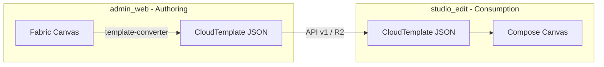

# Kế Hoạch Cải Tiến Giao Diện `admin_web` — Template Editor Chuẩn Canva Web

> Đồng bộ với module `studio_edit` (Android) làm **source of truth** về chức năng & UX.
> Tham chiếu: `UI_IMPROVEMENT_PLAN.md`, `AGENTS.md` (4 quy tắc persona Canva).
> Phạm vi: trình sửa template tại `/templates/[id]/edit` — không bao gồm dashboard list/import.

---

## A. Mục tiêu & Nguyên tắc

### Mục tiêu

1. **Parity chức năng**: mọi tool/panel mà user thấy trên mobile (`studio_edit`) phải có tương đương trên web admin — cùng semantic, cùng `CloudTemplate` contract.
2. **Chuẩn Canva web**: canvas-first, contextual toolbar, smart guides, zero-confirmation, motion mượt — không phải admin dashboard cũ.
3. **Single source of truth**: `canvas_data` (CloudTemplate) là contract chính; `fabric_state` chỉ là view-state phục vụ round-trip admin, không được drift khỏi mobile.

### 4 quy tắc persona (áp dụng cho web)

| Quy tắc | Áp dụng web |
|---|---|
| **Zero-confirmation** | Auto-commit khi blur/click-away; không modal xác nhận cho edit thường; crop/align apply ngay |
| **Clean UI** | Artboard ≥ 65% viewport; panel collapse mặc định; một đường nhập text (inline canvas) |
| **Spring motion** | Panel slide spring (Framer Motion / CSS spring); không `transition: 150ms linear` cho translate |
| **Phản biện sáng tạo** | Giữ keyboard shortcuts & rulers (web có bàn phím); **không** copy desktop-only clutter từ Canva full (comments, multi-page, brand kit) |

### Vai trò từng module



**Admin web = authoring tool.** Mobile = consumption + user edit. Mọi thay đổi UI admin phải validate qua `template-validate.ts` + `CloudTemplateParityTest` (studio_edit).

---

## B. Đánh giá hiện trạng `admin_web`

### Điểm mạnh (giữ & tận dụng)

| Hạng mục | Bằng chứng |
|---|---|
| Fabric.js engine trưởng thành | `CanvasWorkspace.tsx`, `fabric-setup.ts`, custom serialize props |
| Layer panel đầy đủ | `LayerPanel.tsx` — visibility, lock, drag z-order, rename, duplicate |
| Dual export path | `fabric_state` round-trip + `canvas_data` cho mobile |
| Asset pipeline | R2 upload, `/api/proxy` whitelist, `cdn-rewriter.ts` |
| PSD import | `psd-client-import.ts` — lợi thế admin-only |
| Keyboard shortcuts | `useKeyboardShortcuts.ts` — Ctrl+Z/Y, nudge, group |
| Background removal | MediaPipe `background-remover.ts` |
| Publish validation | `template-validate.ts` + Zod `template-contract.ts` |
| Auto-save | 45s debounce trong `edit/page.tsx` |

### Gap so với `studio_edit` (parity matrix)

| Nhóm | `studio_edit` | `admin_web` hiện tại | Gap |
|---|---|---|---|
| **Chrome layout** | Top bar + bottom tool dock + peek controls | Top toolbar + 3 cột cố định | Khác layout, artboard bị bóp |
| **Bottom tools** | 10 tools: Replace, Sticker, Label, Frame, Rotate, Shadow, Opacity, Crop, Duplicate, Delete | Toolbar: Text, Shape, Image, Crop, Grid, Snap | Thiếu Label/Frame/Sticker/Shadow/Opacity dock |
| **Label panel** | 11 icon tabs canvas-first | `TextPropertiesSection` flat form | Không có tab bar, không canvas-first |
| **Frame/Shape panel** | 6 tabs: Fill, Stroke, Shadow, Elevation, Arrange, Shape | `ShapePropertiesSection` + shape dropdown | Thiếu Arrange tab, elevation, icon tabs |
| **Crop** | In-canvas overlay + ratio chips + pan | `CropImageModal` → layer mới | Modal destructive, không overlay |
| **Multi-select** | Long-press toggle + `selectedLayerIds` | Fabric `ActiveSelection` marquee | Semantic khác; thiếu group frame+label expand |
| **Snap guides** | Layer-to-layer + rule-of-thirds + sticky | Canvas center/edge + ruler guides | **Thiếu object-to-object smart guides** |
| **Gesture preview** | `GesturePreview` ngoài state | Full JSON snapshot mỗi modify | Performance risk |
| **Zero-confirmation** | No Done buttons, keyboard-hide | Toast + confirm dialogs | Nhiều confirm thủ công |
| **Motion** | `MotionTokens` spring | CSS transition tĩnh | Chưa có motion system |
| **Layers rail** | Opt-in vertical strip | `LayerPanel` luôn hiện (cột trái) | Chiếm ~280–340px |
| **Floating toolbar** | `ShapeQuickActionsBar` | `FloatingObjectToolbar` **built, unwired** | Component chết |
| **Mini-map** | — (mobile reject) | `MiniMap` **built, unwired** | Có thể wire (web hợp lý) |
| **Loading state** | Shimmer artboard | Spinner toàn trang | Chưa shimmer |
| **i18n** | ~100 `studio_*` keys × 67 locale | Hardcoded VI trong toolbar/panels | Chưa có key system |
| **Frame+Label group** | `groupId` + `LayerGroupSync` | Fabric group, converter partial | Cần parity converter |

### Lỗi / rủi ro P0 (ưu tiên trước UI đẹp)

| # | Vấn đề | Vị trí | Hệ quả |
|---|---|---|---|
| W1 | **Dual-state drift** | `fabric_state` ↔ `canvas_data` via `template-converter.ts` | Mobile render sai layer/group/crop |
| W2 | Layer load error block save nhưng manual save vẫn xóa layer lỗi | `edit/page.tsx` | Mất dữ liệu template |
| W3 | Crop modal default → `addImageLayerFromUrl` (layer mới) | `CropImageModal.tsx` | Không match mobile crop-in-place |
| W4 | Undo = full canvas JSON serialize (max 30) | `editor.store.ts` | Lag template nhiều ảnh |
| W5 | Panel width state phân mảnh | `useUiStore` + localStorage keys khác nhau | UX inconsistent |
| W6 | Styling `indigo-*` hardcode, không dùng semantic tokens | Toàn editor chrome | Không đồng bộ design system |
| W7 | `FloatingObjectToolbar` + `MiniMap` không mount | `CanvasWorkspace.tsx` | Feature chết, selection actions chỉ ở panel phải |
| W8 | Không có `CloudTemplateParityTest` tương đương web | — | Regression converter không bắt sớm |

---

## C. Kiến trúc mục tiêu (đồng bộ `studio_edit`)

### C.1 State model — mirror `EditorState` + events

Tạo `src/domains/editor/editor.types.ts` + Zustand slice `editor-ui.store.ts`:

```typescript
// Parity với studio_edit EditorState.kt
interface EditorUiState {
  selectedLayerId: string | null;
  selectedLayerIds: Set<string>;      // Phase 5 mobile
  editingLayerId: string | null;      // inline text edit
  selectedTool: EditorTool | null;    // sealed union mirror
  showLayersPanel: boolean;           // opt-in, default false
  controlsExpanded: boolean;          // peek mode, default false
  showOverlay: boolean;
  errorMessage: string | null;
  isDirty: boolean;
  isSaving: boolean;
}
```

**Event bus** — `src/domains/editor/editor.events.ts` mirror `EditorEvents.kt`:
- `SelectLayer`, `ToggleLayerSelection`, `DeselectLayer`
- `SelectTool`, `SelectCropRatio`, `UpdateCropPan`, `CommitCrop`
- `StartTextEdit`, `FinishTextEdit`
- `AlignLayer`, `MoveLayerUp/Down/...`
- `ClearError`

Fabric mutations chỉ xảy ra trong **command handlers** (`canvas-commands.ts` mở rộng), không scatter trong components.

### C.2 Layout mục tiêu — Canva web + studio_edit hybrid

```
┌─────────────────────────────────────────────────────────────┐
│ [←] Template name · Saved 14:32    [Undo][Redo][Layers][⬇] │  ← TopBar (minimal)
├─────────────────────────────────────────────────────────────┤
│                                                             │
│  ┌─ Layer rail (opt-in, 72px collapsed / 280px expanded)   │
│  │                                                          │
│  │              ┌──────────────────┐                       │
│  │              │    ARTBOARD      │  ← ≥65% viewport      │
│  │              │  (Fabric canvas) │                       │
│  │              │  + smart guides  │                       │
│  │              │  + crop overlay  │                       │
│  │              └──────────────────┘                       │
│  │         [FloatingObjectToolbar]  ← trên selection       │
│  │                                                          │
│  ├──────────────────────────────────────────────────────────┤
│  │ [Replace][Sticker][Label][Frame][↻][Shadow][◐][Crop]…  │  ← BottomToolDock
│  ├──────────────────────────────────────────────────────────┤
│  │ ▲ peek: [Font][Size][Color]…  (1 row chips)              │  ← ContextPanel
│  │     expanded: full tab content scroll                   │
│  └─────────────────────────────────────────────────────────┘
│  [Asset drawer] — slide from right khi cần                   │
└─────────────────────────────────────────────────────────────┘
```

**Khác biệm có chủ đích vs mobile:**
- **Giữ** ruler + keyboard shortcuts (web affordance)
- **Giữ** Properties panel có thể mở bên phải (power-user) nhưng **mặc định đóng** — contextual bottom panel là primary
- **Bỏ** cột Properties cố định chiếm 320px

### C.3 Design tokens — mirror `EditorDesignTokens.kt`

Tạo `src/styles/editor-tokens.css` (hoặc `src/lib/editor-tokens.ts`):

| Token mobile | Web equivalent |
|---|---|
| `moduleBackground` `#EBEBEB` | `--editor-workspace-bg` |
| `artboard` white + shadow 16dp | `--editor-artboard-bg`, `--editor-artboard-shadow` |
| `accent` / `accentSoft` | `--editor-accent`, `--editor-accent-soft` |
| `textPrimary` / `textSecondary` | `--editor-text-*` |
| `MotionTokens.springPanel` | `cubic-bezier(0.34, 1.56, 0.64, 1)` hoặc Framer `type: spring` |
| `MotionTokens.springEmphasized` | toolbar selection scale 1.08 |
| `MotionTokens.fadeQuick` | opacity 120ms (không spring) |

Quét thay `indigo-600` / `slate-*` trong `CanvasWorkspace`, `EditorToolbar`, `LayerPanel`, `fabric-setup.ts` selection color.

### C.4 Tool → Component mapping (parity checklist)

| `EditorTool` (mobile) | Web component mục tiêu | Nguồn tái sử dụng |
|---|---|---|
| Replace | `ReplaceToolButton` + file picker | `ImagePropertiesSection` replace |
| Sticker | `StickerToolPanel` | `AssetSidebar` stickers tab |
| Label | `LabelToolPanel` (11 tabs) | Mới — mirror `LabelSelectionToolbar` + `LabelEditSection` |
| Shape/Frame | `ShapeToolPanel` (6 tabs) | Mới — mirror `ShapePanel` + `ShapeIconTabBar` |
| Rotate | `RotateToolPanel` | `PropertiesPanel` flip section |
| Shadow | `ShadowToolPanel` | `ShapePropertiesSection` + image shadow |
| Opacity | `OpacityToolPanel` | `PropertiesPanel` blend/opacity |
| Crop | `CropToolPanel` + `CropOverlay` | Thay `CropImageModal` |
| Duplicate | instant | `FloatingObjectToolbar` / shortcut |
| Delete | instant | `FloatingObjectToolbar` / shortcut |

---

## D. Kế hoạch triển khai theo Phase

### Phase 0 — Contract safety & test harness (3–4 ngày) ⚠️ BLOCKER

> Không đổi UI cho đến khi Phase 0 xong.

1. **Parity test suite web**: port logic `CloudTemplateParityTest` → `admin_web/src/lib/template-converter.parity.test.ts`
   - Round-trip: Fabric → Cloud → Fabric (tolerance epsilon)
   - Field coverage: `groupId`, `groupRole`, `cropRatio`, `cropOffsetX/Y`, `blendMode`, `shadowRegion`
2. **Fix W2**: layer load error → soft block + banner, không silent delete on save
3. **Converter audit**: map đủ 14 `ShapeType` + `TEXT_ONLY` + frame/label split (`EditorLayerNormalizer` parity)
4. **Migrate script**: mở rộng `migrate-validate-templates.ts` báo cáo field lệch mobile
5. **Single persist path**: mọi save đi qua `fabricToCloudTemplate()` → validate → PUT; log diff nếu converter thay đổi layer count

**DoD Phase 0:** 0 regression trên 59 templates hiện có; parity test CI green.

---

### Phase 1 — Layout restructure & design tokens (1 tuần)

1. **TopBar** tách khỏi `edit/page.tsx` → `EditorTopBar.tsx`
   - Back, template name, autosave indicator, Undo/Redo, Layers toggle, Export PNG/WEBP, Publish link
2. **BottomToolDock** mới — mirror `EditorBottomToolbar.kt`
   - 10 tools, horizontal scroll, spring selection pill, press scale 0.97
   - Tool re-tap → đóng panel **không** deselect (parity B8 mobile)
3. **ContextPanel** peek/expand — mirror `EditorControlsV2`
   - Mặc định collapsed (1 hàng chip/tab icon)
   - `controlsExpanded` persist localStorage
4. **Layer rail opt-in** — refactor `LayerPanel` thành overlay trái
   - Default **đóng**; mở bằng nút Layers (parity mobile)
   - Collapsed = icon stack 72px; expanded = 280px
5. **Ẩn PropertiesPanel cố định** — chuyển nội dung vào ContextPanel theo `selectedTool`
6. **`editor-tokens.css`** + quét màu hardcode phase 1 (toolbar, layer panel, fabric selection `#6366f1` → token)
7. **Loading shimmer** khi fetch template — thay `Loader2` full-page

**DoD Phase 1:** Artboard ≥ 65% viewport ở 1440×900; 0 panel cố định ≥ 280px khi mặc định.

---

### Phase 2 — Label & Frame panels (1.5 tuần)

#### 2A. Label tool (mirror `LabelSelectionToolbar` + `LabelEditSection`)

| Tab | Web component | studio_edit reference |
|---|---|---|
| EDIT | Inline `IText` edit on canvas | `StartTextEdit` / `FinishTextEdit` |
| FONT | `FontPickerSheet` | `LabelFontSection` |
| SIZE | slider 1–200sp | `LabelSizeSection` |
| TEXT_STYLE | bold/italic/underline/strike + presets | `LabelTextStyleSection` |
| FORMAT | line-height, letter-spacing, transform | `LabelFormatSection` |
| ALIGN | H + V align | `LabelAlignSection` |
| TEXT_COLOR | solid + gradient | `LabelGradientSection` (text mode) |
| BG_COLOR | solid + gradient fill | `LabelGradientSection` (bg mode) |
| ELEVATION | 3D text effect | `ShapeElevationSection` |
| TEXT_FORM | path/warp | `TextFormSection` |
| SHAPE | frame shape picker | `LabelShapeSection` |

**UX rules:**
- Tab nhớ khi đổi label → label (parity B7)
- Không nút Done — blur / click-away = `FinishTextEdit`
- Keyboard toolbar: hide-keyboard icon, không checkmark (parity Phase 3 mobile)

#### 2B. Frame/Shape tool (mirror `ShapePanel`)

| Tab | Web component |
|---|---|
| FILL | `GradientEditor` (solid/linear/radial) |
| STROKE | color, width, dash |
| SHADOW | intensity, angle, distance, blur, presets |
| ELEVATION | conditional `supportsFrameElevationUi` |
| ARRANGE | z-order + canvas align (6 nút) |
| SHAPE | `ShapeGallery` 14 types |

**Creation mode:** tool active + không chọn layer → `LabelCreateSection` / `ShapeGallery` (parity mobile).

---

### Phase 3 — Canvas UX parity (1.5 tuần)

1. **Smart guides** — mở rộng `useCanvasSnapping.ts`
   - Object-to-object: left/right/center H, top/bottom/center V (magenta lines, parity `BoundingBoxMath.calculateSnapV2`)
   - Rule-of-thirds
   - Sticky snap + break-away threshold
   - **Không** thay ruler guides hiện có — bổ sung thêm
2. **Crop overlay** — thay `CropImageModal` default path
   - `CropOverlay.tsx`: rule-of-thirds grid + drag pan + ratio chips (`CropToolPanel`)
   - `cropOffsetX/Y` trên Fabric image object → converter map sang `CloudLayer`
   - Zero-confirmation: tool switch / click-away = commit
3. **Multi-select semantic**
   - Shift+click / marquee → `selectedLayerIds` trong `editor-ui.store`
   - Ctrl+click toggle (web equivalent long-press mobile)
   - Group expand: chọn frame → auto-select label sibling (converter `groupId`)
   - Batch move/scale/delete/align
4. **Wire `FloatingObjectToolbar`**
   - Position above selection bounding rect
   - Actions: duplicate, delete, lock, z-order, flip (parity `ShapeQuickActionsBar`)
5. **Wire `MiniMap`** (optional, web-only)
   - Góc dưới trái, 120×80px, click to pan
6. **Inline text edit lifecycle**
   - Double-click text → `editingLayerId`, hide Fabric controls, show keyboard toolbar

**DoD Phase 3:** Crop + multi-select + smart guides hoạt động; converter round-trip `cropOffset` verified.

---

### Phase 4 — Zero-confirmation, motion & performance (1 tuần)

1. **Auto-commit pattern**
   - Property inputs: debounce 300ms → push history (mirror `HISTORY_DEBOUNCE_MS`)
   - Xóa `Dialog` confirm cho edit thường; chỉ giữ confirm cho Delete template / Publish
   - `ClearError` sau toast (parity B1)
2. **Motion system** — `src/lib/motion-tokens.ts` + Framer Motion
   - Panel enter/exit: `springPanel`
   - Toolbar selection: `springEmphasized` scale
   - Layer release snap settle: `springSettle` (animate offset 80ms spring)
3. **Undo architecture** — command pattern
   - Thay full JSON snapshot bằng `CanvasCommand` stack (transform, property, z-order, add/remove)
   - Giữ JSON snapshot mỗi 10 commands làm checkpoint
   - Target: undo < 16ms trên template 20 layer
4. **Gesture preview** (optional Fabric)
   - `object:moving` → update visual only; `object:modified` → commit store + history
5. **Ẩn toast thành công** cho mọi micro-edit (chỉ toast lỗi + save/export)

---

### Phase 5 — Asset, sticker, export & admin-only pro (1 tuần)

| Feature | Hành động |
|---|---|
| Sticker tool | Bottom dock → `StickerPicker` preview row + gallery sheet (decor/meme tabs) |
| Replace tool | Product `PLACEHOLDER_OBJECT` drop-to-replace (đã có, đưa vào dock) |
| Background removal | Giữ trong Replace flow; gate export giống mobile `canExport` |
| Shadow region | Tool hoặc Properties → tạo `SHADOW_REGION` layer |
| Export | Thêm resolution picker (1×, 2×, 3×); WEBP default |
| PSD import | Giữ admin-only; sau import → normalize qua converter mới |
| QR mobile preview | Giữ; thêm deep link preview sau mỗi save |
| Publish validation UI | Inline badge trên TopBar (parity `template-validate`) |

---

### Phase 6 — i18n, a11y & nợ kỹ thuật (rải, 1 tuần)

1. **i18n**: tạo `src/i18n/editor/` mirror `studio_*` keys (en, vi, ja trước)
   - Không copy hardcoded VI từ `ShapeArrangeSection` mobile — dùng key ngay từ đầu
2. **a11y**: `aria-label` cho 10 bottom tools + 17 tab icons; focus trap trong panels
3. **Tách god-files**
   - `edit/page.tsx` (1100+ dòng) → `EditorShell.tsx` + hooks `useTemplateEditor`, `useAutosave`
   - `CanvasWorkspace.tsx` → `useCanvasGestures`, `useCanvasSnapping`, `useSmartGuides`
4. **Dead code xóa** sau khi wire: `CropImageModal` old path, duplicate panel widths trong `useUiStore`
5. **Screenshot regression** (optional): Playwright snapshot `templates/[id]/edit` với template fixture

---

## E. Ma trận đồng bộ cross-module

Mỗi feature phải có entry trong bảng này trước khi ship:

| Feature | studio_edit file | admin_web file | converter field | Test |
|---|---|---|---|---|
| Label 11 tabs | `LabelSelectionToolbar.kt` | `LabelToolPanel.tsx` (mới) | `CloudLayer.type=TEXT` | parity test |
| Frame 6 tabs | `ShapePanel.kt` | `ShapeToolPanel.tsx` (mới) | `SHAPE` + gradients | parity test |
| Crop overlay | `CropOverlay.kt` | `CropOverlay.tsx` (mới) | `cropRatio`, `cropOffsetX/Y` | `CropMathTest` port |
| Multi-select | `SelectionState.kt` | `editor-ui.store.ts` | — | unit test |
| Group frame+label | `LayerGroup.kt` | converter + Fabric group | `groupId`, `groupRole` | parity test |
| Smart guides | `BoundingBoxMath.kt` | `useSmartGuides.ts` (mới) | — | visual test |
| Bottom 10 tools | `EditorBottomToolbar.kt` | `BottomToolDock.tsx` (mới) | — | e2e |
| Peek controls | `EditorControlsV2` | `ContextPanel.tsx` (mới) | — | visual test |
| Motion tokens | `EditorDesignTokens.kt` | `motion-tokens.ts` | — | — |
| Error clear | `ClearError` event | `clearError()` action | — | unit test |

**Quy trình ship feature:**
1. Implement mobile (đã có) → document event/state
2. Port converter field nếu thiếu
3. Implement web UI
4. Parity test pass
5. Manual QA: edit web → save → load trên emulator `studio_edit`

---

## F. Definition of Done (toàn dự án)

- [ ] Layout canvas-first: artboard ≥ 65% viewport mặc định (1440×900)
- [ ] 10 bottom tools parity `EditorBottomToolbar.kt`
- [ ] Label 11 tabs + Frame 6 tabs hoạt động, tab memory khi đổi selection
- [ ] 0 nút Done trong flow edit; auto-commit on blur
- [ ] Crop in-canvas overlay + 6 ratio presets + pan offset
- [ ] Smart guides object-to-object (magenta) + canvas center/edge
- [ ] `FloatingObjectToolbar` wired; `MiniMap` wired (web)
- [ ] `selectedLayerIds` multi-select + batch ops
- [ ] Converter parity test CI green; 0 drift trên template corpus
- [ ] Undo < 16ms p95 (template 20 layer) sau command-pattern
- [ ] Panel transitions dùng spring tokens
- [ ] i18n en/vi/ja cho toàn bộ editor chrome
- [ ] Web edit → save → mobile load: visual match ≥ 95% (manual checklist)

---

## G. Rủi ro & quyết định cần chốt

| Rủi ro | Giảm thiểu |
|---|---|
| Fabric ↔ CloudTemplate drift | Phase 0 blocker; không ship UI trước parity test |
| Layout mới phá muscle-memory admin | Feature flag `EDITOR_V2_LAYOUT`; rollout toggle trong settings |
| Command-pattern undo phức tạp | Checkpoint JSON mỗi 10 commands; fallback legacy undo |
| 3 cột → canvas-first gây mất Properties | Giữ Properties drawer opt-in (phím P) cho power-user |
| Framer Motion bundle size | Lazy import; chỉ panel transitions |
| Label/Frame panel 17 tabs → quá rộng mobile web | Horizontal scroll icon tabs (đã chứng minh trên mobile) |

### Quyết định đề xuất (mặc định nếu không phản hồi)

1. **Layout**: chuyển sang canvas-first (Phase 1) — không giữ 3 cột cố định
2. **Rulers**: giữ (web affordance), bổ sung smart guides — không bắt chước mobile reject rulers
3. **Keyboard shortcuts**: giữ + mở rộng (T=text, S=shape, C=crop, G=toggle guides)
4. **MiniMap**: wire (web-only, mobile không có)
5. **i18n**: en base + vi/ja đầy đủ; locale khác fallback en
6. **Source of truth**: `studio_edit` events/states đặt tên; web mirror, không đặt tên riêng

---

## H. Timeline tổng hợp

| Phase | Thời gian | Phụ thuộc |
|---|---|---|
| 0 — Contract safety | 3–4 ngày | — |
| 1 — Layout + tokens | 1 tuần | Phase 0 |
| 2 — Label + Frame panels | 1.5 tuần | Phase 1 |
| 3 — Canvas UX | 1.5 tuần | Phase 0, 2 |
| 4 — Motion + perf | 1 tuần | Phase 1–3 |
| 5 — Asset + export | 1 tuần | Phase 2–3 |
| 6 — i18n + a11y | 1 tuần | Rải song song |

**Tổng ước tính: 7–8 tuần** (1 dev full-time), hoặc **4–5 tuần** (2 dev song song Phase 2/3).

---

## I. Bước tiếp theo đề xuất

1. **Chốt quyết định mục G** (layout canvas-first, MiniMap, feature flag)
2. **Bắt Phase 0** — parity test + converter audit (không đổi UI)
3. **Tạo Figma/wireframe** `BottomToolDock` + `ContextPanel` peek (optional)
4. **Spike 2 ngày**: `CropOverlay.tsx` trên Fabric + converter `cropOffset` field

> File tham chiếu: `UI_IMPROVEMENT_PLAN.md` (mobile), `AGENTS.md` (persona), `template-contract.ts` (schema).
