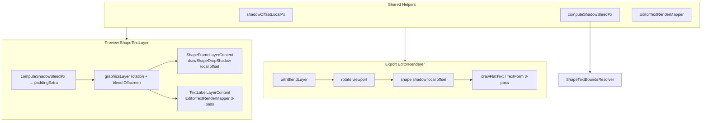

# Kế Hoạch Sửa 3 Bug Text Box — `studio_edit`

> **Phạm vi:** Text box (layer `TEXT`, `SHAPE_TEXT`, `SHAPE` có nhãn) — preview Compose canvas + export `EditorRenderer`.
> **Nguyên tắc:** Không domino (mỗi bug sửa độc lập, có rollback riêng); **preview = export parity** trên cùng `EditorLayer` UDF.
> **Tham chiếu đã đọc:** `EditorShadowMapper.kt`, `ShapeFrameLayerContent.kt`, `EditorRenderer.kt`, `TextFormLayoutEngine.kt`, `ShapeTextLayer.kt`, `ShapeTextBoundsResolver.kt`, `TextLabelLayerContent.kt`, `EditorAppearance.kt`, `ProductLayer.kt` (đối chiếu IMAGE shadow đúng).
> **Không có** `conversation_review.md` tại repo root — bám theo evaluation đã verify trên code thực.

---

## 1. Tóm tắt điều hành & Mục tiêu

### Vấn đề

Ba bug ảnh hưởng trực tiếp chất lượng Text Box trên mobile editor:

| Bug | Triệu chứng người dùng | Mức độ |
|-----|------------------------|--------|
| **A — Shadow xoay theo khung** | Xoay text box → hướng đổ bóng quay theo khung thay vì cố định theo màn hình (như Canva / Fabric) | P0 |
| **B — Thiếu pass shadow/stroke** | Text Form và flat text chỉ vẽ **fill**; stroke + drop shadow không xuất hiện hoặc lệch so với template admin_web | P0 |
| **C — Shadow bị cắt (clip)** | Bóng mờ / blend mode bị cắt ở mép layer; padding cố định không đủ | P0 |

### Mục tiêu

1. **Parity preview ↔ export:** Cùng pipeline vẽ (shadow → stroke → fill), cùng công thức offset/bleed.
2. **Không regression IMAGE:** `renderShadowCached` giữ nguyên thứ tự transform (offset world-space → rotate) — đã đúng.
3. **Giữ kiến trúc hiện có:** `EditorLayer` + UDF, `textSizeSp` qua `GestureLayerOps`, auto-fit qua `ShapeTextBoundsResolver`.
4. **Không domino:** Mỗi phase merge được độc lập; feature flag tạm nếu cần (`EditorFeatureFlags.textShadowParity`).

### Điểm mạnh giữ nguyên (không refactor)

- Scale text qua `textSizeSp` trong `GestureLayerOps.applyDelta` — đúng semantic label pinch.
- `ShapeTextBoundsResolver` auto-fit flat + text-form — chỉ **mở rộng** để tính shadow bleed.
- Tách `ShapeFrameLayerContent` / `TextLabelLayerContent` — chỉ bổ sung helper vẽ chung, không gộp composable.

---

## 2. Phân tích từng bug

### Bug A — Shadow xoay theo text box

#### Root cause

Offset bóng (`shadowOffset`) được áp dụng **trong hệ tọa độ đã xoay** của layer, nên vector (dx, dy) xoay cùng `viewport.rotation`.

**Preview — shape shadow trong khung xoay:**

```254:276:studio_edit/src/main/java/com/thgiang/image/studio/ui/editor/canvas/ShapeTextLayer.kt
                .graphicsLayer {
                    rotationZ = layer.viewport.rotation
                    // ...
                },
        ) {
            if (layer.shouldRenderFrameContent) {
                ShapeFrameLayerContent(  // drawShapeDropShadow bên trong → offset local
```

```66:75:studio_edit/src/main/java/com/thgiang/image/studio/ui/editor/canvas/shape/ShapeFrameLayerContent.kt
                if (canDrawShapeShadow) {
                    drawShapeDropShadow(
                        shapeType = layer.shapeType,
                        appearance = layer.appearance,
                        scale = displayScale,
```

```39:68:studio_edit/src/main/java/com/thgiang/image/studio/ui/editor/mapper/EditorShadowMapper.kt
    fun DrawScope.drawShapeDropShadow(...) {
        val (dx, dy) = shadowOffsetPx(appearance, scale)
        nativeCanvas.translate(dx, dy)  // không counter-rotate
        nativeCanvas.drawShapeGeometry(...)
```

**Export — shape shadow sau `rotate`:**

```386:437:studio_edit/src/main/java/com/thgiang/image/studio/ui/editor/EditorRenderer.kt
            withSave {
                rotate(state.rotation, left + shapeW / 2f, top + shapeH / 2f)
                // ...
                if (canDrawShapeShadow && layer.appearance.shadowIntensity > 0.05f) {
                    val (shadowDx, shadowDy) = shadowOffset(
                        layer.appearance.shadowAngle,
                        layer.appearance.shadowDistance,
                    )
                    drawShapeGeometry(
                        left = left + shadowDx,  // offset trong canvas đã rotate
```

**Đối chiếu IMAGE — đúng, không sửa:**

```213:227:studio_edit/src/main/java/com/thgiang/image/studio/ui/editor/EditorRenderer.kt
        canvas.withSave {
            translate(drawX + dx, drawY + dy)   // offset TRƯỚC rotate
            scale(scaleX, scaleY)
            rotate(state.rotation, ...)
            drawBitmap(shadow, ...)
```

**Preview IMAGE — đúng:** `ProductLayer` áp `offset(shadowDx, shadowDy)` ở modifier ngoài `graphicsLayer.rotationZ` (world-space).

#### Solution design

1. Thêm API counter-rotation trong `EditorShadowMapper`:

```kotlin
/** Offset trong world/screen space (không xoay theo layer). */
fun shadowOffsetWorldPx(appearance: EditorAppearance, scale: Float = 1f): Pair<Float, Float>

/** Offset trong local space của layer đã xoay [rotationDeg]. */
fun shadowOffsetLocalPx(
    appearance: EditorAppearance,
    scale: Float = 1f,
    rotationDeg: Float = 0f,
): Pair<Float, Float>
```

Công thức:

```
(dx_w, dy_w) = shadowOffset(angle, distance) * scale
θ = rotationDeg in radians
dx_local =  dx_w * cos(-θ) - dy_w * sin(-θ)
dy_local =  dx_w * sin(-θ) + dy_w * cos(-θ)
```

2. **Preview shape shadow:** `drawShapeDropShadow` dùng `shadowOffsetLocalPx(..., layer.viewport.rotation)`.
3. **Export shape shadow:** `renderShapeTextLayer` dùng cùng helper (rotation = `state.rotation`).
4. **Text glyph shadow (Bug B):** Khi vẽ glyph trong canvas đã rotate, dùng `shadowOffsetLocalPx`; khi vẽ ngoài rotate (tuỳ chọn refactor preview), dùng `shadowOffsetWorldPx`.

#### API changes

| API | Thay đổi |
|-----|----------|
| `EditorShadowMapper.shadowOffsetPx` | Giữ backward-compat = alias `shadowOffsetWorldPx` |
| `EditorShadowMapper.shadowOffsetLocalPx` | **Mới** |
| `EditorShadowMapper.drawShapeDropShadow` | Thêm param `rotationDeg: Float = 0f` |
| `computeShadowBleedPx` | Dùng world offset + blur (xem Bug C) |

#### Call sites cập nhật

| File | Hàm / vị trí | Thay đổi |
|------|--------------|----------|
| `EditorShadowMapper.kt` | `drawShapeDropShadow` | `rotationDeg` + local offset |
| `ShapeFrameLayerContent.kt` | `drawShapeDropShadow(...)` ~L67 | Truyền `layer.viewport.rotation` |
| `EditorRenderer.kt` | `renderShapeTextLayer` ~L417-437 | Dùng `shadowOffsetLocalPx` thay `shadowOffset` thô |
| `EditorRenderer.kt` | `drawShapeTextContent` (sau Bug B) | Glyph shadow dùng local offset trong rotated save |
| `TextFormLayoutEngine.kt` (sau Bug B) | `drawOnCanvas` | Shadow pass dùng local offset |

**Không đổi:** `renderShadowCached`, `ProductLayer` shadow offset.

---

### Bug B — `TextFormLayoutEngine.drawOnCanvas` chỉ fill; flat text thiếu stroke/shadow

#### Root cause

**Text Form — chỉ một pass fill:**

```101:110:studio_edit/src/main/java/com/thgiang/image/studio/ui/editor/mapper/TextFormLayoutEngine.kt
        glyphs.forEach { spec ->
            canvas.save()
            canvas.translate(spec.x, spec.y)
            canvas.rotate(spec.rotationDeg)
            canvas.drawText(spec.char, 0f, 0f, fillPaint)  // chỉ FILL
            canvas.restore()
        }
```

**Export flat text — chỉ fill `StaticLayout`:**

```612:646:studio_edit/src/main/java/com/thgiang/image/studio/ui/editor/EditorRenderer.kt
        val fillLayout = StaticLayout(...)
        // ...
        canvas.withSave {
            translate(translateX, textTop)
            fillLayout.draw(this)  // không shadow, không stroke pass
        }
```

`buildTextPaint` có nhánh `Paint.Style.STROKE` (~L555-562) nhưng **không được gọi**.

**Preview flat text — Compose `Text` không map `appearance.shadow` / `strokeWidthPx`:**

```146:163:studio_edit/src/main/java/com/thgiang/image/studio/ui/editor/canvas/text/TextLabelLayerContent.kt
                Text(
                    text = displayText,
                    style = textStyle,  // không có shadow/stroke native
```

**Preview text form — Canvas fill only** qua `drawTextForm` → `drawOnCanvas`.

Thứ tự đúng (parity Fabric / admin_web `Shadow` trên `IText`): **shadow → stroke → fill**.

#### Solution design

Tạo **`EditorTextRenderMapper`** (object mới, tách khỏi layout engine):

```kotlin
object EditorTextRenderMapper {
    /** Flat text: shadow → stroke → fill. Dùng chung preview + export. */
    fun drawFlatTextOnCanvas(
        canvas: Canvas,
        layer: EditorLayer,
        left: Float, top: Float,
        width: Float, height: Float,
        renderScale: Float,
        context: Context,
        alpha: Int = ...,
        rotationDeg: Float = 0f,  // cho counter-rotate shadow offset
    )

    /** Warped glyphs: shadow → stroke → fill per glyph. */
    fun drawGlyphsOnCanvas(
        canvas: Canvas,
        glyphs: List<GlyphDrawSpec>,
        layer: EditorLayer,
        left: Float, top: Float,
        renderScale: Float,
        context: Context,
        alpha: Int = ...,
        rotationDeg: Float = 0f,
    )

    fun buildTextPaints(layer, textSizePx, alpha, context): TextPaintTriple
    // fill, stroke (nullable), shadow (BlurMaskFilter)
}
```

**`TextFormLayoutEngine.drawOnCanvas`:** delegate sang `EditorTextRenderMapper.drawGlyphsOnCanvas` sau `computeGlyphs`.

**`EditorRenderer.drawShapeTextContent`:** thay `fillLayout.draw` bằng `drawFlatTextOnCanvas`.

**`TextLabelLayerContent`:** với `!textForm.isActive && !isInlineEditing`, thay `Text(...)` bằng `Canvas` + `drawFlatTextOnCanvas` (giữ `BasicTextField` khi inline edit). Có thể giữ Compose `Text` chỉ khi không có shadow/stroke (fast path) — tuỳ benchmark.

**Shadow trên glyph:** `TextPaint` + `BlurMaskFilter(resolvedShadowBlurRadius() * scale)` + `shadowOffsetLocalPx` translate trước `drawText`.

**Stroke trên glyph:** `Paint.Style.STROKE`, `strokeWidthPx * renderScale`, màu `strokeColorArgb ?: textColorArgb`.

#### API changes

| Thành phần | Thay đổi |
|------------|----------|
| `TextFormLayoutEngine.drawOnCanvas` | Gọi mapper 3-pass; giữ public signature |
| `TextFormLayoutEngine.computeGlyphs` | Không đổi |
| `EditorRenderer.drawShapeTextContent` | Delegate `EditorTextRenderMapper` |
| `TextLabelLayerContent` | Canvas path cho flat text có effect |
| **Mới** `EditorTextRenderMapper.kt` | Shared draw + paint builders |

#### Call sites cập nhật

| File | Ghi chú |
|------|---------|
| `TextFormLayoutEngine.kt` | `drawOnCanvas`, có thể `drawTextForm` (DrawScope wrapper) |
| `EditorRenderer.kt` | `drawShapeTextContent`, `renderShapeTextLayer` (text branch) |
| `TextLabelLayerContent.kt` | Nhánh flat text ~L145-164 |
| `TextFormSection.kt` | Preview icon — **OUT** (chỉ fill demo, không parity export) |
| `TextElevationMapper.kt` | **Không đổi** — elevation ≠ drop shadow |

#### Điều kiện kích hoạt shadow/stroke

```kotlin
val hasDropShadow = layer.appearance.shadowIntensity > 0.05f
val hasTextStroke = layer.strokeColorArgb != null && layer.strokeWidthPx > 0f
```

`supportsFrameShadowUi` chỉ gate **UI tab shape** — text glyph shadow áp dụng khi `appearance.shadowIntensity > 0.05f` bất kể `TEXT_ONLY` (frame shadow vẫn không vẽ geometry rỗng).

---

### Bug C — Shadow clipping (Offscreen blend, padding cố định)

#### Root cause

**1. `CompositingStrategy.Offscreen` khi blend mode ≠ normal** — clip nội dung vào bounds layer trước khi composite:

```259:264:studio_edit/src/main/java/com/thgiang/image/studio/ui/editor/canvas/ShapeTextLayer.kt
                    compositingStrategy = if (EditorBlendModeMapper.needsOffscreenCompositing(layer.blendMode)) {
                        CompositingStrategy.Offscreen
                    } else {
```

`needsOffscreenCompositing` = true cho `multiply`, `screen`, v.v. (`EditorBlendModeMapper.kt` ~L59-60). **Không liên quan `alpha < 1`.**

**2. Padding cố định không đủ bleed:**

```227:238:studio_edit/src/main/java/com/thgiang/image/studio/ui/editor/canvas/ShapeTextLayer.kt
    val paddingExtra = 40.dp
    // ...
    .requiredSize(displayW + paddingExtra * 2, displayH + paddingExtra * 2),
```

Shadow lớn (blur 22px template × scale, distance 24px, góc xoáy) + stroke có thể vượt 40dp → bị cắt bởi Offscreen hoặc parent clip.

**3. `ShapeTextBoundsResolver` không tính shadow bleed** — auto-fit chỉ padding 12/6dp + stroke:

```94:118:studio_edit/src/main/java/com/thgiang/image/studio/ui/editor/label/model/ShapeTextBoundsResolver.kt
        val paddingH = PADDING_H_DP * density
        val paddingV = PADDING_V_DP * density
        val strokePad = shapeStrokePadding(layer)
        // không có shadowBleed
```

`MIN_WIDTH_PX = 60f` là min geometry, không phải shadow pad — nhưng user thường nhầm với padding 60dp; plan dùng **dynamic bleed** thay hằng số.

#### Solution design

**Helper `computeShadowBleedPx` (trong `EditorShadowMapper` hoặc `EditorAppearance.kt`):**

```kotlin
fun computeShadowBleedPx(
    appearance: EditorAppearance,
    scale: Float,
    rotationDeg: Float = 0f,
    extraStrokePx: Float = 0f,
): Float {
    if (appearance.shadowIntensity <= 0.05f) return extraStrokePx
    val blur = appearance.resolvedShadowBlurRadius() * scale
    val (dx, dy) = shadowOffsetWorldPx(appearance, scale)
    // Bounding box của shadow offset + blur kernel (~3σ)
    val kernel = blur * 3f
    val extentX = kotlin.math.abs(dx) + kernel
    val extentY = kotlin.math.abs(dy) + kernel
    // Xoay bbox nếu cần conservative pad
    val rot = Math.toRadians(rotationDeg.toDouble())
    val pad = maxOf(
        extentX * kotlin.math.abs(kotlin.math.cos(rot)) + extentY * kotlin.math.abs(kotlin.math.sin(rot)),
        extentX * kotlin.math.abs(kotlin.math.sin(rot)) + extentY * kotlin.math.abs(kotlin.math.cos(rot)),
    )
    return pad + extraStrokePx + 2f // safety px
}
```

**`ShapeTextLayer`:**

```kotlin
val bleedPx = computeShadowBleedPx(layer.appearance, templateScale, layer.viewport.rotation, strokePad)
val paddingExtra = with(density) { bleedPx.toDp() }.coerceAtLeast(8.dp)
```

**`ShapeTextBoundsResolver`:** thêm `shadowBleedPad(layer, density)` vào `applyFlatFit` / `fitShapeToTextForm`:

```kotlin
private fun shadowBleedPad(layer: EditorLayer, density: Float): Float =
    computeShadowBleedPx(
        appearance = layer.appearance,
        scale = layer.viewport.scale,  // template px space
        rotationDeg = layer.viewport.rotation,
        extraStrokePx = shapeStrokePadding(layer),
    )
```

**Bounding box overlay** (`80.dp` ~L307-309): đồng bộ `max(80.dp, paddingExtra + margin)` để handle không bị lệch.

**Tùy chọn tối ưu (OUT phase này):** Tách shadow ra sibling Box ngoài `graphicsLayer` Offscreen — phức tạp với blend mode; ưu tiên dynamic padding trước.

#### Call sites cập nhật

| File | Thay đổi |
|------|----------|
| `EditorShadowMapper.kt` / `EditorAppearance.kt` | `computeShadowBleedPx` |
| `ShapeTextLayer.kt` | Dynamic `paddingExtra` |
| `ShapeTextBoundsResolver.kt` | Cộng `shadowBleedPad` vào fit |
| `ProductLayer.kt` | Đồng bộ pattern (consistency, không bắt buộc cho text box) |

---

## 3. Bảng phạm vi (IN / OUT)

| Hạng mục | IN | OUT |
|----------|----|----|
| Counter-rotate shape drop shadow (preview + export) | ✅ | |
| Counter-rotate text glyph drop shadow | ✅ (qua Bug B) | |
| Text form shadow → stroke → fill | ✅ | |
| Flat text shadow → stroke → fill (preview + export) | ✅ | |
| Dynamic shadow bleed padding | ✅ | |
| `ShapeTextBoundsResolver` sync bleed | ✅ | |
| `renderShadowCached` (IMAGE) | | ✅ Giữ nguyên |
| `ProductLayer` preview shadow order | | ✅ Đã đúng |
| 3D elevation (`TextElevationMapper`) | | ✅ Khác semantic |
| Text Form preset icon (`TextFormSection`) | | ✅ Chỉ demo UI |
| Label UI: mở shadow tab cho `TEXT_ONLY` | | 🔜 Future |
| `admin_web` Fabric parity | | 🔜 Future |
| Pinch shadow scale theo viewport | | 🔜 Future |
| Refactor tách shadow layer khỏi Offscreen | | 🔜 Nếu padding chưa đủ |

---

## 4. Shared helpers mới

| Helper | Vị trí đề xuất | Mô tả |
|--------|----------------|-------|
| `shadowOffsetWorldPx` | `EditorShadowMapper` | Offset theo `shadowAngle`/`shadowDistance`, không phụ thuộc rotation layer |
| `shadowOffsetLocalPx` | `EditorShadowMapper` | Counter-rotate world offset vào local space |
| `computeShadowBleedPx` | `EditorShadowMapper` | Pad động = \|offset\| + 3×blur + stroke; có rotation bbox |
| `configureTextShadowPaint` | `EditorTextRenderMapper` | `BlurMaskFilter` + opacity từ `shadowIntensity` |
| `drawFlatTextOnCanvas` | `EditorTextRenderMapper` | StaticLayout 3-pass |
| `drawGlyphsOnCanvas` | `EditorTextRenderMapper` | Per-glyph 3-pass cho text form |
| `buildTextPaints` | `EditorTextRenderMapper` | DRY từ `TextFormLayoutEngine.buildTextPaint` + stroke |

**Dependency graph:**

```
EditorAppearance (shadowOffset, resolvedShadowBlurRadius)
        ↓
EditorShadowMapper (offset world/local, bleed, shape drop shadow)
        ↓
EditorTextRenderMapper (glyph + flat text draws)
        ↓
TextFormLayoutEngine / EditorRenderer / TextLabelLayerContent
        ↓
ShapeTextBoundsResolver (bleed vào fit)
```

---

## 5. Phân phase A → C → B

### Phase A — Counter-rotation shadow (Bug A)

**Mục tiêu:** Hướng bóng cố định theo màn hình khi xoay text box (shape shadow + chuẩn bị offset cho text shadow).

| # | Task | File | Ước lượng |
|---|------|------|-----------|
| A1 | Implement `shadowOffsetWorldPx` / `shadowOffsetLocalPx` + unit test lượng giác | `EditorShadowMapper.kt`, test mới | 0.5 ngày |
| A2 | Thêm `rotationDeg` vào `drawShapeDropShadow` | `EditorShadowMapper.kt` | 0.25 ngày |
| A3 | Truyền `layer.viewport.rotation` từ preview | `ShapeFrameLayerContent.kt` | 0.25 ngày |
| A4 | Sửa `renderShapeTextLayer` shape shadow offset | `EditorRenderer.kt` | 0.25 ngày |
| A5 | Manual QA: xoay 0°/45°/90°/180°, so IMAGE không đổi | — | 0.25 ngày |

**Tổng Phase A: ~1.5 ngày**

**Phụ thuộc:** Không.

**Tiêu chí xong:** Shape drop shadow giữ hướng khi xoay; export PNG khớp preview.

---

### Phase C — Dynamic bleed & bounds (Bug C)

**Mục tiêu:** Không cắt bóng khi blend mode Offscreen; auto-fit box đủ rộng.

| # | Task | File | Ước lượng |
|---|------|------|-----------|
| C1 | Implement `computeShadowBleedPx` + unit test | `EditorShadowMapper.kt`, test | 0.5 ngày |
| C2 | `ShapeTextLayer` dynamic `paddingExtra` | `ShapeTextLayer.kt` | 0.25 ngày |
| C3 | Sync `ShapeTextBoundsResolver` (+ stroke đã có) | `ShapeTextBoundsResolver.kt` | 0.5 ngày |
| C4 | Đồng bộ `BoundingBoxOverlay` margin nếu cần | `ShapeTextLayer.kt` | 0.25 ngày |
| C5 | QA: `multiply` blend + shadow mạnh + text form PATH_CIRCLE | — | 0.5 ngày |

**Tổng Phase C: ~2 ngày**

**Phụ thuộc:** A (dùng `shadowOffsetWorldPx` trong bleed).

**Tiêu chí xong:** Không clip shadow ở blur=22, distance=24, rotation=30°; đổi text không shrink box cắt bóng.

---

### Phase B — Render passes shadow/stroke/fill (Bug B)

**Mục tiêu:** Parity đầy đủ hiệu ứng chữ preview = export.

| # | Task | File | Ước lượng |
|---|------|------|-----------|
| B1 | Tạo `EditorTextRenderMapper` + paint builders | File mới | 1 ngày |
| B2 | Wire `TextFormLayoutEngine.drawOnCanvas` | `TextFormLayoutEngine.kt` | 0.5 ngày |
| B3 | Wire `drawShapeTextContent` export | `EditorRenderer.kt` | 0.5 ngày |
| B4 | Preview flat text → Canvas path | `TextLabelLayerContent.kt` | 0.75 ngày |
| B5 | Golden test export PNG (1–2 fixture) | `studio_edit/src/test/...` | 1 ngày |
| B6 | QA matrix font / gradient / stroke / shadow / warp | — | 0.75 ngày |

**Tổng Phase B: ~4.5 ngày**

**Phụ thuộc:** A (local offset cho glyph shadow trong rotated canvas); C khuyến nghị trước B để không clip khi test shadow.

**Tiêu chí xong:** Template `text_gradient` + `decoration_text_fallback` parity; text form có bóng + viền.

---

### Tổng effort

| Phase | Ngày | Tích lũy |
|-------|------|----------|
| A | 1.5 | 1.5 |
| C | 2.0 | 3.5 |
| B | 4.5 | **8.0** |

Buffer review + CI: **+1.5 ngày** → **~9.5 ngày** (1 dev).

---

## 6. Ma trận thay đổi file

| File | Phase | Thay đổi |
|------|-------|----------|
| `mapper/EditorShadowMapper.kt` | A, C | `shadowOffsetLocalPx`, `computeShadowBleedPx`, `drawShapeDropShadow(rotationDeg)` |
| `model/EditorAppearance.kt` | C | (Tuỳ chọn) re-export `computeShadowBleedPx` |
| `canvas/shape/ShapeFrameLayerContent.kt` | A | Truyền rotation vào drop shadow |
| `EditorRenderer.kt` | A, B | Shape shadow local offset; `drawShapeTextContent` → mapper |
| `canvas/ShapeTextLayer.kt` | C | Dynamic bleed padding; overlay margin |
| `label/model/ShapeTextBoundsResolver.kt` | C | `shadowBleedPad` trong fit |
| `mapper/TextFormLayoutEngine.kt` | B | Delegate 3-pass draw; có thể tách `buildTextPaint` |
| `canvas/text/TextLabelLayerContent.kt` | B | Canvas flat text thay Compose `Text` khi có effects |
| `mapper/EditorTextRenderMapper.kt` | B | **File mới** — shared text draw |
| `canvas/ProductLayer.kt` | C | (Tuỳ chọn) dynamic padding đồng bộ |
| `test/.../EditorShadowMapperTest.kt` | A, C | **File mới** |
| `test/.../EditorTextRenderMapperTest.kt` | B | **File mới** |
| `test/.../ShapeTextBoundsResolverTest.kt` | C | **File mới** |
| `test/.../TextBoxGoldenRenderTest.kt` | B | **File mới** — bitmap golden |

**Không sửa:** `renderShadowCached`, `GestureLayerOps.kt`, `TextElevationMapper.kt`, `CloudLayerToEditorMapper.kt` (trừ khi test fixture cần).

---

## 7. Kế hoạch test

### Unit tests

| Test | Assert |
|------|--------|
| `shadowOffsetLocalPx` rotation=0 → bằng world | A |
| `shadowOffsetLocalPx` rotation=90 → dx/dy hoán vị có dấu đúng | A |
| `computeShadowBleedPx` intensity=0 → chỉ stroke pad | C |
| `computeShadowBleedPx` blur=22, distance=24 ≥ 40dp tại scale 3 | C |
| `fitShapeToText` với shadow lớn → `shapeWidth/Height` tăng đủ bleed | C |
| `drawGlyphsOnCanvas` mock canvas: shadow draw trước fill (order spy) | B |
| `buildTextPaints` stroke null khi `strokeWidthPx=0` | B |

### Golden / snapshot tests

- Render `EditorRenderer.renderShapeTextLayer` cho fixture `text_gradient` (từ `CloudTemplateParityTest.PARITY_FIXTURE`) — so sánh PNG hash hoặc pixel diff tolerance 1%.
- Một fixture text form `PATH_ARC_UP` + shadow + stroke.

### Manual checklist

- [ ] **A:** Layer CARD + text, shadow 50%, xoay 45° — bóng hướng xuống-phải màn hình, không xoay theo khung
- [ ] **A:** IMAGE product cùng template — shadow không đổi sau Phase A
- [ ] **C:** Blend `multiply` + shadow — không cắt mép
- [ ] **C:** Sửa text dài — box auto-fit, bóng không clip
- [ ] **B:** Flat text + stroke 6px — viền hiện preview & export
- [ ] **B:** Text form WARP + shadow — 3 lớp đúng thứ tự
- [ ] **B:** Inline edit — không double-draw shadow
- [ ] **B:** Gradient fill text — shader chỉ trên fill pass
- [ ] Pinch label scale (`GestureLayerOps`) — shadow scale theo `textSizeSp`, không theo viewport.scale
- [ ] Export PNG full template — không regression layer IMAGE

---

## 8. Risk register & Rollback

| ID | Rủi ro | Xác suất | Tác động | Giảm thiểu | Rollback |
|----|--------|----------|----------|------------|----------|
| R1 | Counter-rotation sai dấu với `flippedH/V` | Trung bình | Cao | Unit test matrix flip+rotate; manual QA | Revert A commits only |
| R2 | Offscreen vẫn clip dù tăng pad | Thấp | Trung bình | Conservative `3×blur`; tăng `+2f` safety | Tăng hệ số bleed; future tách layer |
| R3 | Preview Canvas flat text chậm hơn Compose `Text` | Trung bình | Thấp | Fast path khi không shadow/stroke | Giữ Compose path khi effects off |
| R4 | `ShapeTextBoundsResolver` over-fit làm box quá lớn | Trung bình | Thấp | Chỉ cộng bleed khi `shadowIntensity > 0.05` | Feature flag bleed trong resolver |
| R5 | Golden test flaky trên GPU khác | Trung bình | Thấp | Tolerance 1–2%; render software bitmap | Bỏ golden, giữ unit order tests |
| R6 | Double shadow (shape + text glyph) trên framed text | Thấp | Trung bình | Document: frame shadow = geometry; text shadow = glyph — hoặc gate glyph shadow khi `shouldRenderFrameContent && canDrawShapeShadow` | Toggle trong mapper |

**Chiến lược rollback tổng thể:**

- Mỗi phase = 1 PR riêng (`fix/text-shadow-rotation`, `fix/text-shadow-bleed`, `fix/text-render-passes`).
- Revert PR không ảnh hưởng phase khác đã merge.
- Feature flag `LocalEditorFlags.textShadowParityEnabled` (default `true` sau B ổn định) cho `EditorTextRenderMapper`.

---

## 9. Definition of Done

- [ ] Cả 3 bug **A, B, C** pass manual checklist trên thiết bị thật (API 26+ và 34+).
- [ ] Unit tests mới pass CI (`studio_edit:testDebugUnitTest`).
- [ ] Ít nhất 1 golden/export test pass với tolerance documented.
- [ ] `CloudTemplateParityTest` hiện có **không regression**.
- [ ] Preview và export được verify cùng layer state (không cần chỉnh tay sau export).
- [ ] Không thay đổi contract `CloudTemplate` / `EditorLayer` serialized fields.
- [ ] Code review: không duplicate paint logic giữa `TextFormLayoutEngine` và `EditorRenderer`.
- [ ] PR description link tới file plan này.

---

## 10. Future work (ngoài scope)

| Hạng mục | Mô tả |
|----------|-------|
| **Flat text stroke parity nâng cao** | Underline/linethrough trên stroke path; dash stroke text |
| **Label pinch shadow scale** | Khi pinch label, scale `shadowDistance`/`shadowBlur` theo `textSizeSp` delta (hiện chỉ scale geometry) |
| **TEXT_ONLY shadow UI** | Mở tab Shadow cho plain text không khung (`supportsFrameShadowUi` hiện false) |
| **admin_web parity** | Fabric `Shadow` trên `IText` ↔ `EditorTextRenderMapper`; test cross-platform trong `template-converter.parity.test.ts` |
| **Tách shadow khỏi Offscreen** | Vẽ shadow sibling ngoài `graphicsLayer` để giảm pad oversized |
| **GPU blur preview** | `RenderEffect` cho text shadow preview thay `BlurMaskFilter` CPU trên Canvas |
| **Gestures** | `GesturePreview` hiển thị shadow đúng trong drag (đã có `GestureLayerOps` — chỉ cần bleed khi preview layer) |

---

## Phụ lục — Sơ đồ pipeline sau sửa



---

*Cập nhật: 2026-07-10 — chỉ tài liệu kế hoạch, chưa implement code.*
